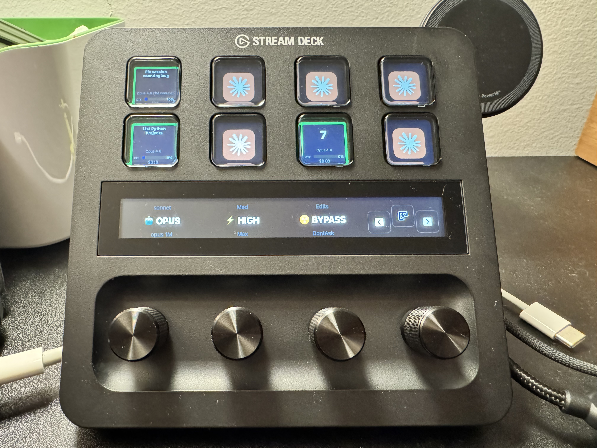

# streamdeck-claude

> See what your Claude Code sessions are doing without switching windows.

I run multiple Claude Code sessions in parallel across different projects. Constantly tab-switching to check which one is thinking, which one needs input, and how much context is left gets old fast. This plugin puts all of that on the Stream Deck + hardware so I can glance down and know.

Each session gets a button showing its name, status, context usage, and cost. Dials let you spin up new sessions with the right model/effort/permissions without typing. Press a button to jump to that iTerm2 tab.



## Requirements

- macOS 13+
- [Elgato Stream Deck +](https://www.elgato.com/stream-deck-plus) with Stream Deck app 6.4+
- [Node.js](https://nodejs.org/) 20+
- [iTerm2](https://iterm2.com/) with AppleScript enabled
- [Claude Code](https://docs.anthropic.com/en/docs/claude-code) CLI

## Install

```bash
git clone https://github.com/vsavinkov/streamdeck-claude.git
cd streamdeck-claude
./install.sh
```

That's it. The installer builds everything, links the plugin, configures Claude Code hooks, and starts a background bridge server via launchd.

To remove everything cleanly:

```bash
./install.sh --uninstall
```

## Setup

After install, restart the Stream Deck app, then:

1. Find **Claude Code Monitor** in the action list on the right
2. Drag **Agent Key** onto LCD keys (up to 8)
3. Set each key's **Slot** number (1-8) in the Property Inspector
4. Drag **Model Dial**, **Effort Dial**, and **Permission Dial** onto encoder slots
5. Start a Claude Code session -- it appears on your deck

## Usage

### Keys

Each key shows one Claude Code session with a colored border, AI-generated name, context bar, model, and cost.

| Gesture | On active session | On empty slot |
|---------|-------------------|---------------|
| **Click** | Focus the iTerm2 tab | Create new session |
| **Double click** | Send `/compact` to session | -- |
| **Long press** (1s+) | Kill session | -- |

### Status colors

| Color | Meaning |
|-------|---------|
| Yellow | Claude is working |
| Green | Idle / waiting for input |
| Red | Session ended or crashed |

### Dials

Three rotary encoders control what kind of session gets created when you push any dial or click an empty key.

| Dial | Rotate | Push | Default |
|------|--------|------|---------|
| Model | haiku / sonnet / opus / opus 1M | New session | opus 1M |
| Effort | low / med / high / max | New session | high |
| Permission | edits / bypass / dontAsk / plan / auto | New session | bypass |

Rotating past the end of the list plays a click sound so you know you've hit the boundary.

### Debug UI

The bridge server runs a live web dashboard at [localhost:9120](http://localhost:9120) showing all session state in real time. Useful for troubleshooting.

## How it works

```
Claude Code (1..8 sessions)
  ├─ Status line script ──→ writes JSON to ~/.claude/streamdeck/sessions/
  └─ Hooks (HTTP POST) ──→ Bridge server

Bridge Server (localhost:9120)
  ├─ Watches session files (chokidar) ──→ detects context/cost/model changes
  ├─ Receives hooks ──→ tracks working/idle/stopped status
  ├─ AI-summarizes first user message ──→ generates button labels
  └─ WebSocket ──→ pushes state to plugin

Stream Deck Plugin
  ├─ Renders SVG buttons from bridge state
  ├─ Updates encoder LCDs (model/effort/perm selectors)
  └─ AppleScript ──→ iTerm2 tab focus, new tab, /compact, kill
```

The plugin runs inside the Stream Deck app's Node.js sandbox. The bridge server is a separate process that aggregates data from all Claude sessions and pushes updates over WebSocket. No polling anywhere.

Session names are generated by piping the first user message through `claude -p --model haiku --effort low`. A quick truncation is shown immediately while the AI summary runs in the background.

Sessions persist until they end or the Claude process dies. The bridge checks iTerm2 TTYs and process tables every 5 seconds to detect crashed sessions.

## Development

```bash
# Watch mode
cd bridge && npm run dev     # bridge with auto-reload
cd plugin && npm run watch   # plugin with auto-rebuild

# After plugin changes
npx @elgato/cli restart com.vsavinkov.claude

# Logs
cat plugin/com.vsavinkov.claude.sdPlugin/logs/com.vsavinkov.claude.0.log
tail -f ~/Library/Logs/ElgatoStreamDeck/StreamDeck.log

# Test hooks manually
curl -s http://localhost:9120/hook/notification \
  -X POST -d '{"session_id":"test"}' -H "Content-Type: application/json"

# Debug dashboard
open http://localhost:9120

# JSON API
curl -s http://localhost:9120/api/state | python3 -m json.tool

# Package for distribution
./package.sh
```

## Project structure

```
streamdeck-claude/
├── bridge/                             # Bridge server (Node.js + TypeScript)
│   ├── src/
│   │   ├── server.ts                   # HTTP + WebSocket server + debug UI
│   │   ├── session-watcher.ts          # File watcher, AI name derivation
│   │   ├── state.ts                    # Session lifecycle, cleanup logic
│   │   └── types.ts                    # Shared types and constants
│   └── scripts/
│       └── status-line.sh              # Installed to ~/.claude/streamdeck/
├── plugin/                             # Stream Deck plugin
│   ├── src/
│   │   ├── plugin.ts                   # Entry point
│   │   ├── bridge-client.ts            # WebSocket client, slot management
│   │   ├── dial-state.ts              # Model/effort/perm shared state
│   │   ├── iterm.ts                    # AppleScript helpers
│   │   ├── actions/
│   │   │   ├── agent-key.ts            # Key gestures (click/double/long)
│   │   │   ├── model-dial.ts           # Model selector encoder
│   │   │   ├── effort-dial.ts          # Effort selector encoder
│   │   │   └── perm-dial.ts            # Permission selector encoder
│   │   └── renderers/
│   │       └── button-svg.ts           # SVG templates for buttons
│   └── com.vsavinkov.claude.sdPlugin/  # Plugin bundle
│       ├── manifest.json
│       ├── imgs/                       # Icons
│       ├── ui/                         # Property Inspector HTML
│       └── layouts/                    # Encoder LCD layouts
├── config/
│   └── claude-settings-snippet.json    # Hook + status line config
├── install.sh                          # One-command install (+ --uninstall)
└── package.sh                          # Build .streamDeckPlugin archive
```

## Maintainer

[Viacheslav Savinkov](https://github.com/vsavinkov)
